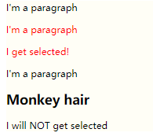

# Adjacent sibling

用 **+** 实现选择，用于两个相邻元素的选择，这会使得选择非常方便

```html
<div>
        <p>I'm a paragraph</p>
        <p>I'm a paragraph</p>
        <p>I get selected!</p>
    </div>
    <div>
        <p>I'm a paragraph</p>
        <h2>Monkey hair</h2>
        <p>I will NOT get selected</p>
    </div>
</div>
```

```css
p + p {
    color: red;
}
```



