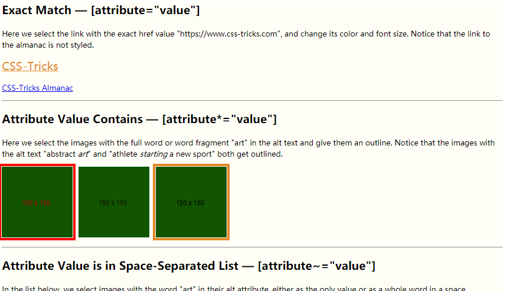

# [attribute]

1. [att]
2. [att\*="foo"]
3. [att\^="foo"]
4. [att\~="foo"]
5. [att\|="foo"]
6. [att\$="foo"]


```
还可以and选择 [att|="foo"][att~="foo"]
```


```html
<div class="main-content">
    <h2>Exact Match &mdash; [attribute="value"]</h2>
    <p>Here we select the link with the exact href value "https://www.css-tricks.com", and change its color and font
        size. Notice that the link to the almanac is not styled.</p>
    <p><a href="https://www.css-tricks.com">CSS-Tricks</a></p>
    <p><a href="https://www.css-tricks.com/almanac">CSS-Tricks Almanac</a></p>
    <hr>

    <h2>Attribute Value Contains &mdash; [attribute*="value"]</h2>
    <p>Here we select the images with the full word or word fragment "art" in the alt text and give them an outline.
        Notice that the images with the alt text "abstract <i>art</i>" and "athlete <i>starting</i> a new sport" both
        get outlined. </p>

    <div class="gallery">
        
        
        
    </div>
    <hr>

    <h2>Attribute Value is in Space-Separated List &mdash; [attribute~="value"]</h2>
    <p>In the list below, we select images with the word "art" in their alt attribute, either as the only value or as a
        whole word in a space separated list. Notice that the image with the alt text "athlete starting a new sport" is
        not outlined like it was in the "Attribute Contains" example.</p>
    <div class="gallery2">
        
        
        
    </div>
    <hr>

    <h2>Attribute Value Starts With &mdash; [attribute^="value"]</h2>
    <p>Here we select the images with alt text that starts with "art". Notice that the image with the alt text "artistic
        pattern" is selected, but the image with the alt text "Arthur Miller" is not because attribute selectors are
        case-sensitive. </p>
    <div class="gallery3">
        
        
        
    </div>
    <hr>

    <h2>Attribute Value is First in Dash-Separated List &mdash; [attribute|="value"]</h2>
    <p>Selecting the list item with a data-decade attribute that has "1900" as the only value or the first in a dash
        separated list. Notice that only the 2nd list item is selected. The first list item has "1900" in its data
        attribute value, but it's after the dash.</p>
    <ul>
        <li data-years="1800-1900">The 19th Century</li>
        <li data-years="1900-2000">The 20th Century</li>
        <li data-years="2000-2100">The 21st Century</li>
    </ul>
    <hr>

    <h2>Attribute Value Ends With &mdash; [attribute$="value"]</h2>
    <p>In the paragraph below we select the link with the href that ends with "pdf" and apply an icon as :after
        content.</p>
    <p class="story">A humble digital file becomes self-aware and starts conversations with web developers. <i>Read the
        fascinating account in <a href="//s3-us-west-2.amazonaws.com/s.cdpn.io/652/example.pdf">example.pdf</a></i></p>
</div>
```

```
.main-content {
    width: 70%;
    margin: 60px auto;
    background: #fffef6;
}

a[href="https://www.css-tricks.com"] {
    /*属性为该选中*/
    font-size: 1.5em;
    color: #e18728;
}

img[alt*="art"] {
    /*属性中含有字段选中*/
    outline: 5px solid #e18728;
    outline-offset: 2px;
}

img[alt~="art"] {
    /*属性中整个值选中*/
    outline: 5px solid red;
    outline-offset: 2px;
}

img[alt^="art"] {
    /*属性中以此字段开头,大小写敏感*/
    outline: 5px solid blue;
    outline-offset: 2px;
}

li[data-years|="1900"] {
    /*属性值第一个值为1900选中*/
    color: orchid;
}

body {
    font-family: sans-serif;
    width: 90%;
    margin: 0 auto;
    line-height: 1.5;
}

img {
    margin-right: .5em;
}

hr {
    margin: 1em 0;
    clear: both;
}

.story {
    text-indent: 1em;
    font-family: serif;
    font-size: 1.2em;
}

.story:first-letter {
    font-size: 1.5em;
}
```

