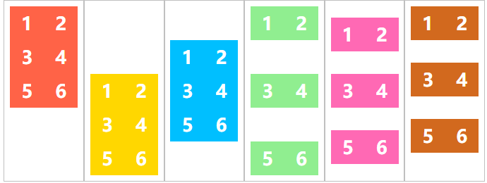

# Align-content


## align-content接受6个属性值

| align-content: | 效果                                         |
| :------------- | :------------------------------------------- |
| flex-start     | 捆绑放置在容器头                             |
| flex-end       | 捆绑放置在容器尾                             |
| center         | 捆绑放置在容器中心                           |
| space-between  | 第一块在容器头，第二块在容器尾，其他间隔均匀 |
| space-around   | 均匀放置                                     |
| stretch        | 线条拉伸，占用其他空间                       |

演示

```html
<ul class="flex-container flex-start">
    <li class="flex-item">1</li>
    <li class="flex-item">2</li>
    <li class="flex-item">3</li>
    <li class="flex-item">4</li>
    <li class="flex-item">5</li>
    <li class="flex-item">6</li>
</ul>

<ul class="flex-container flex-end">
    <li class="flex-item">1</li>
    <li class="flex-item">2</li>
    <li class="flex-item">3</li>
    <li class="flex-item">4</li>
    <li class="flex-item">5</li>
    <li class="flex-item">6</li>
</ul>

<ul class="flex-container center">
    <li class="flex-item">1</li>
    <li class="flex-item">2</li>
    <li class="flex-item">3</li>
    <li class="flex-item">4</li>
    <li class="flex-item">5</li>
    <li class="flex-item">6</li>
</ul>

<ul class="flex-container space-between">
    <li class="flex-item">1</li>
    <li class="flex-item">2</li>
    <li class="flex-item">3</li>
    <li class="flex-item">4</li>
    <li class="flex-item">5</li>
    <li class="flex-item">6</li>
</ul>

<ul class="flex-container space-around">
    <li class="flex-item">1</li>
    <li class="flex-item">2</li>
    <li class="flex-item">3</li>
    <li class="flex-item">4</li>
    <li class="flex-item">5</li>
    <li class="flex-item">6</li>
</ul>

<ul class="flex-container stretch">
    <li class="flex-item">1</li>
    <li class="flex-item">2</li>
    <li class="flex-item">3</li>
    <li class="flex-item">4</li>
    <li class="flex-item">5</li>
    <li class="flex-item">6</li>
</ul>
```


```css
.flex-container {
    margin: 0;
    list-style: none;
    float: left;
    width: 120px;
    height: 300px;
    padding: 10px;
    border: 1px solid silver;
    margin-top: 10px;

    -ms-box-orient: horizontal;
    display: -webkit-box;
    display: -moz-box;
    display: -ms-flexbox;
    display: -moz-flex;
    display: -webkit-flex;
    display: flex;

    -webkit-flex-flow: row wrap;
    flex-flow: row wrap;
}

.flex-start {
    -webkit-align-content: flex-start;
    align-content: flex-start;
}

.flex-end {
    -webkit-align-content: flex-end;
    align-content: flex-end;
}

.flex-end li {
    background: gold;
}

.center {
    -webkit-align-content: center;
    align-content: center;
}

.center li {
    background: deepskyblue;
}

.space-between {
    -webkit-align-content: space-between;
    align-content: space-between;
}

.space-between li {
    background: lightgreen;
}

.space-around {
    -webkit-align-content: space-around;
    align-content: space-around;
}

.space-around li {
    background: hotpink;
}

.stretch {
    -webkit-align-content: stretch;
    align-content: stretch;
}

.stretch li {
    background: chocolate;
}

.flex-item {
    background: tomato;
    padding: 5px;
    width: 50px;
    height: 50px;

    line-height: 50px;
    color: white;
    font-weight: bold;
    font-size: 2em;
    text-align: center;
}
```





## ps
详情查看 [align-content_tricks](https://css-tricks.com/almanac/properties/a/align-content/)

