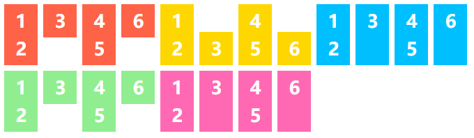

# Align-items

## Align-items的属性

| Align-items : | 效果 |
| ------------- | ---- |
| flex-start    | 元素按边缘起始行开始 |
| flex-end      | 元素按边缘最后行开始 |
| center        | 元素按轴线放置 |
| baseline     | 元素按基准行放置 |
| stretch       | 元素拉伸放置 |


```html
<ul class="flex-container flex-start">
    <li class="flex-item">1<br>2</li>
    <li class="flex-item">3</li>
    <li class="flex-item">4<br>5</li>
    <li class="flex-item">6</li>
</ul>

<ul class="flex-container flex-end">
    <li class="flex-item">1<br>2</li>
    <li class="flex-item">3</li>
    <li class="flex-item">4<br>5</li>
    <li class="flex-item">6</li>
</ul>

<ul class="flex-container center">
    <li class="flex-item">1<br>2</li>
    <li class="flex-item">3</li>
    <li class="flex-item">4<br>5</li>
    <li class="flex-item">6</li>
</ul>

<ul class="flex-container baseline">
    <li class="flex-item">1<br>2</li>
    <li class="flex-item">3</li>
    <li class="flex-item">4<br>5</li>
    <li class="flex-item">6</li>
</ul>

<ul class="flex-container stretch">
    <li class="flex-item">1<br>2</li>
    <li class="flex-item">3</li>
    <li class="flex-item">4<br>5</li>
    <li class="flex-item">6</li>
</ul>
```


```css

.flex-container {
    padding: 0;
    margin: 0;
    list-style: none;
    -ms-box-orient: horizontal;
    display: flex;
    float: left;
}

.flex-start {
    align-items: flex-start;
}

.flex-end {
    align-items: flex-end;
}

.flex-end li {
    background: gold;
}

.center {
    align-content: center;
}

.center li {
    background: deepskyblue;
}

.baseline {
    align-items: baseline;
}

.baseline li {
    background: lightgreen;
}

.stretch {
    align-items: stretch;
}

.stretch li {
    background: hotpink;
}

.flex-item {
    background: tomato;
    padding: 5px;
    width: 50px;
    margin: 5px;

    line-height: 50px;
    color: white;
    font-weight: bold;
    font-size: 2em;
    text-align: center;
}
```





## ps:

详情查看 [align-items_tricks](<https://css-tricks.com/almanac/properties/a/align-items/>)

