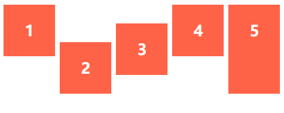

# align-self

align-self 可以覆盖align-align-items

| Align-self 属性值 | 效果   |
| ----------------- | ------ |
| flex-start        | 首部   |
| flex-end          | 底部   |
| center            | 中心   |
| baseline          | 基准线 |
| stretch           | 拉伸   |


```html
<ul class="flex-container">
    <li class="flex-item flex-start">1</li>
    <li class="flex-item flex-end">2</li>
    <li class="flex-item center">3</li>
    <li class="flex-item baseline">4</li>
    <li class="flex-item stretch">5</li>
</ul>
```


```css
.flex-container {
    padding: 0;
    margin: 0;
    list-style: none;
    display: flex;
    height: 200px;

}

.flex-start {
    align-self: flex-start;
}

.flex-end {
    align-self: flex-end;
}

.center {
    align-self: center;
}


.baseline {
    align-self: baseline;
}


.stretch {
    align-self: stretch;
}


.flex-item {
    background: tomato;
    padding: 5px;
    width: 100px;
    margin: 5px;

    line-height: 100px;
    color: white;
    font-weight: bold;
    font-size: 2em;
    text-align: center;
}
```


## 演示




## PS

参考网站 [CSS-Tricks](<https://css-tricks.com/almanac/properties/a/align-self/>)