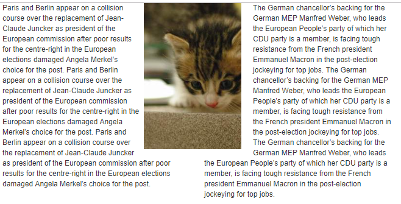
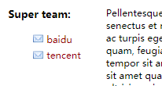
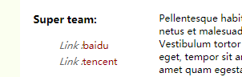
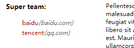
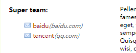

# before/after

:before 与 :after是伪元素，实际不存在DOM元素中，但却显示在页面，看起来像是DOM元素，下面实现几个应用

* 六角星
**css**
~~~

#start-six {
    width: 0;
    height: 0;
    border-left: 50px solid transparent;
    border-right: 50px solid transparent;
    border-bottom: 100px solid red;
    position: relative;
}

#start-six:after {
    width: 0;
    height: 0;
    border-left: 50px solid transparent;
    border-right: 50px solid transparent;
    border-top: 100px solid red;
    position: absolute;
    content: "";
    top: 30px;
    left: -50px;
}
~~~
**显示效果**

* 杂志
**css**
~~~
.left {
    float: left;
}

.right {
    float: right;
}

.box {
    height: 0;
}
/*
  这里不能用after否则会跑到文本内容之下
*/

.left:before, .right:before {
    content: '';
    width: 100px;
    height: 300px;
}
.left:before {
    float: right;
    /*background: #000;*/
}

.right:before {
    float: left;
    /*background: green;*/
}

.cat {
    position: absolute;
    width: 200px;
    height: 300px;
    left: 320px;
}

img {
    width: 100%;
    height: 100%;
}

~~~

/**html**

~~~

    

    

        
Paris and Berlin appear on a collision course over the replacement of Jean-Claude
            Juncker as
            president
            of the European commission after poor results for the centre-right in the European elections damaged Angela
            Merkel’s
            choice for the post.
            Paris and Berlin appear on a collision course over the replacement of Jean-Claude
            Juncker as
            president
            of the European commission after poor results for the centre-right in the European elections damaged Angela
            Merkel’s
            choice for the post.
            Paris and Berlin appear on a collision course over the replacement of Jean-Claude
            Juncker as
            president
            of the European commission after poor results for the centre-right in the European elections damaged Angela
            Merkel’s
            choice for the post.
        

        

        
The German chancellor’s backing for the German MEP Manfred Weber, who leads the
            European People’s
            party of which her CDU party is a member, is facing tough resistance from the French president Emmanuel
            Macron
            in
            the post-election jockeying for top jobs.
            The German chancellor’s backing for the German MEP Manfred Weber, who leads the
            European People’s
            party of which her CDU party is a member, is facing tough resistance from the French president Emmanuel
            Macron
            in
            the post-election jockeying for top jobs.
            The German chancellor’s backing for the German MEP Manfred Weber, who leads the
            European People’s
            party of which her CDU party is a member, is facing tough resistance from the French president Emmanuel
            Macron
            in
            the post-election jockeying for top jobs.
        

    

    

~~~

**效果显示**

* @media

**css**
~~~css
body {
    background: #fbfff0;
    font-size: 14px;
}

#fluid-warp {
    width: 70%;
    margin: 60px auto;
    padding: 20px;
    background: white;
    overflow: hidden;
}

#sidebar ul li a {
    color: #900;
    text-decoration: none;
    padding: 3px 0;
    display: block;
}

#sidebar {
    width: 35%;
    float: left;
}

#sidebar ul li {
    list-style: none;
}

@media all and (min-width: 1001px) {
    #sidebar ul li a:after {
        content: "(" attr(data-email) ")";
        font-size: 11px;
        font-style: italic;
        color: #666;
    }
}

@media all and (max-width: 1000px) and (min-width: 700px) {
    #sidebar ul li a:before {
        content: "Link :";
        font-style: italic;
        color: #666;
    }
}

@media all and  (max-width: 699px) and (min-width: 520px), (min-width: 1151px) {
    #sidebar ul li a {
        padding-left: 21px;
        background: url("../img/email.png") left center no-repeat;
    }
}

#main-content {
    width: 65%;
    float: right;
}

~~~

**html**
~~~html

    

        <h3>Super team:</h3>
        <ul id="nav">
            <li><a data-email="baidu.com" href="https://www.baidu.com">baidu</a></li>
            <li><a data-email="qq.com" href="https://www.qq.com">tencent</a></li>
        </ul>
    

    

        
Pellentesque habitant morbi tristique senectus et netus et malesuada fames ac turpis egestas. Vestibulum
            tortor
            quam, feugiat vitae, ultricies eget, tempor sit amet, ante. Donec eu libero sit amet quam egestas semper.
            Aenean
            ultricies mi vitae est. Mauris placerat eleifend leo. Quisque sit amet est et sapien ullamcorper pharetra.
            Vestibulum erat wisi, condimentum sed, commodo vitae, ornare sit amet, wisi. Aenean fermentum, elit eget
            tincidunt condimentum, eros ipsum rutrum orci, sagittis tempus lacus enim ac dui. Donec non enim in turpis
            pulvinar facilisis. Ut felis. Praesent dapibus, neque id cursus faucibus, tortor neque egestas augue, eu
            vulputate magna eros eu erat. Aliquam erat volutpat. Nam dui mi, tincidunt quis, accumsan porttitor,
            facilisis
            luctus, metus

    

~~~
**结果显示**

**说明**

根据屏幕宽度变化，显示相应的附加信息

### 参考
1.	A Whole Bunch of Amazing Stuff Pseudo Elements Can Do https://css-tricks.com/pseudo-element-roundup/
2.	CSS Media Queries & Using Available Space <https://css-tricks.com/css-media-queries/>